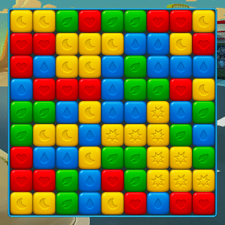
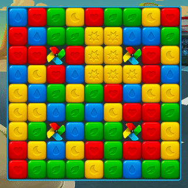
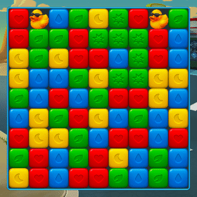
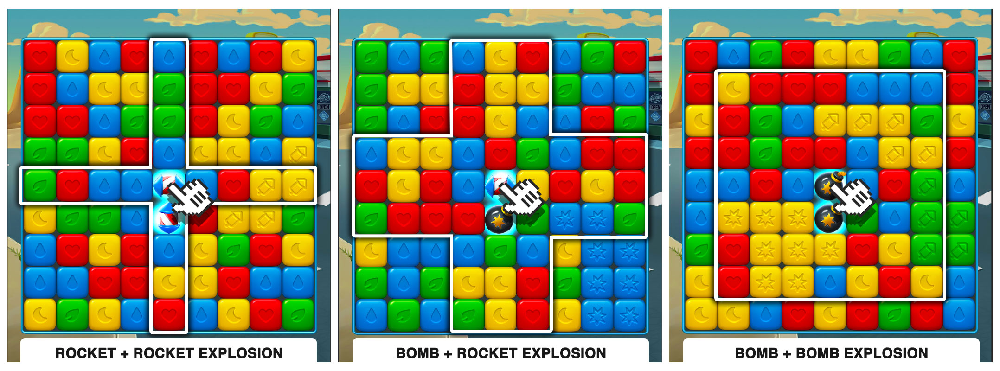

# **UNITHON ENGINEERING 2019**

### GitHub Desktop Açılışı

Aşağıdaki adımları uygulayarak sizin için hazırlamış olduğumuz projeyi kendi bilgisayarınıza çekin:

1. Bilgisayarınızda kurulu olan **GitHub Desktop** uygulamasını açın.
2. **Sign into GitHub.com** ile GitHub.com'a bağlanın.
3. Menüden `File -> Clone Repository`'i seçin.
4. Açılan dialog içinden **GitHub.com** sekmesini seçin.
5. **PeakUnithon19** altında listelenen kendi takımınıza ait **Unithon-Case-Group-X** projesini seçin.
6. LocalPath olarak önerilen dizini kopyalayın.
7. **Clone** butonuna tıklayın.

### Unity Açılış

Aşağıdaki adımları uygulayarak clone'ladığınız projeyi Unity ile açın:

1. Bilgisayarınızda kurulu olan **Unity Hub** uygulamasını açın.
2. Sağ üstteki **Unity Id** butonuna tıklayıp açılan pencereden **Sign-in** butonuna tıklayarak Sign-in penceresini açın.
3. Unity kullanıcınız var ise 5. adıma geçin. Yoksa **create one** linkine tıklayarak kendinize bir **Unity ID** yaratın.
4. Email adresinize gelen `Confirmation maili` ile Unity kullanıcınızı onaylayın.
5. Unity Hub uygulaması üzerinden **Sign in** butonuna tıklayarak Unity'e giriş yapın.
6. Sağ üstteki preferences butonuna tıkladıktan sonra License Management sekmesindeki **Activate New License** butonuna tıklayıp size verilen Unity Lisansını girin.
7. Project sayfasında **Add** butonuna tıkladıktan sonra az önce cloneladığınız proje dizinine gidin ve içinde bulunan **Unithon** klasörünü seçin.
8. Proje Unity Hub'a eklendikten sonra versiyon bölümünde 2019.2.9f1 yazmıyorsa `Select a version` yazan bölüme tıklayarak bu versiyonu seçin.
9. Projenin üzerine tıklayarak açın.
10. Unity açıldıktan sonra Game sekmesine tıklayarak Game penceresini açın.
11. Üst tarafta Free Aspect seçeneğine tıklayın ve alttaki &quot;+&quot; butonuna basın. Çıkan menüden Label bölümüne 9:16 yazın. Type olarak &quot;Aspect Ratio&quot; seçin. Width&amp;Height için sırasıyla 9 ve 16 sayıları girin.
12. Project alanında Scenes altında LevelScene sahnesini çift tıklayarak açın.
13. Hierarchy penceresindeki Level GameObject'inin üzerine tıkladıktan sonra Inspector penceresindeki Current Level menüsünden istediğiniz Level'ı seçin.
14. Play butonuna tıklayarak LevelScene'i çalıştırın.

## Level_0 - Hazır Çalışan Kısım

Sahneyi açtığınızda büyük bir kare göreceksiniz, bu kareye dokümanda ve kod içinde **Board** diyoruz.

Board kendi içinde 9x9=81 adet küçük karelere bölünmüştür, bu küçük karelere ise **Cell** diyoruz.

Her bir cell içinde ise rastgele şekilde dağılmış değişik renklerde küpler olduğunu göreceksiniz. Bu küplere **CubeItem** diyoruz. Bir cell içinde mutlaka CubeItem bulundurmak zorunda değildir, boş kalabilir veya içine başka çeşit bir Item alabilir.

Oyun içerisinde basılarak match'e girmeden patlayan itemlara **SpecialItem** diyoruz. BombItem'ı buna örnek olarak verebiliriz.

Küplere dokunulduğunda ( **tap** edildiğinde), eğer küpler renklerine göre eşleşiyorlarsa ( **match** ediyorlarsa), patladıklarını ve yerlerine bir üzerlerindeki patlamayan küplerin düştüğünü görebilirsiniz. Board içindeki bu düşme işlemine **Fall** diyoruz.

Yok olan küplerin yerine yeni küpler yaratılır. Bu yeni küpler ise board'un en üstünden board'un içine düşerler. Bu küpler daha yeni yaratıldıkları ve board'a dışarıdan girdikleri için bu işleme fall'dan farklı olarak **Fill** diyoruz.

Bu bahsettiklerimiz kodun içinde hazır ve çalışıyor halde bulunuyor. Bir sonraki bölümde açıklayacağımız görevleri bu kodun üzerine geliştirme yaparak ve/veya bu kod üzerinde değişiklik yaparak tamamlamanızı bekliyoruz.

### Görevler

Görevleri yaparken dikkat etmeniz gereken bazı noktalar var:

- Tüm isteklerimizin eksiksiz ve hatasız çalışıyor olması gerekiyor.
- Bu projenin uzun soluklu gerçek bir oyun olduğunu düşünerek geliştirme yapmanız gerekiyor.
- Yazdığınız kodun temiz ve başkaları tarafından rahatça anlaşılır olması gerekiyor.
- Görevleri takım olarak, beraber tamamlamanız gerekiyor.

Bu noktaların hepsini değerlendirme kriterleri başlığı altında görebilirsiniz.

Görevleri yaparken ihtiyacınız olan tüm görselleri biz önceden hazırladık ve kod ile birlikte projenin içine ekleyerek sizin kullanımınıza hazır hale getirdik. İhtiyacınız olan bütün görseller projede mevcuttur.

## Level 1 - ColorBalloonItem

İlk ana görevimiz birbiri ile bağlantılı dört alt görevden oluşuyor. Tüm bu alt görevlerin amacı önceden kısmen hazırlanmış bir item'a eksik olan bazı özelliklerin eklenmesi. Bu item'a **ColorBalloonItem** diyoruz.

### 1. ColorBalloonItem'ın Yanında Match Yapıldığında Patlatılması

Level 1'i  açtığınızda board'un kenarlarında ColorBalloonItem'ları göreceksiniz. ColorBalloonItem'ların yanlarında herhangi bir match yapıldığında patlamalarını bekliyoruz.

### 2. ColorBalloonItem'ın Görselinin Düzeltilmesi

Sizden şu anda renkleri aynı olan ColorBalloonItem'ların match tiplerine göre doğru renkte görünmesini sağlamanızı bekliyoruz.

### 3. ColorBalloonItem'ın Kendi Rengiyle Patlatılması

Bu adımda ColorBalloonItem'ların yanlarında **kendi renkleriyle** match yapıldığında patlamalarını bekliyoruz.

### 4. ColorBalloonItem'ın SpecialItem ile Patlatılması

Board'da bulunan tüm ColorBalloonItem'ların SpecialItem ile (örneğin BombItem) patladıklarında yok olmaları gerekiyor. Bu özelliğin doğru çalıştığını kontrol edip emin olmalısınız.

## Level 2 - PinwheelItem

İkinci görevin amacı level'da tanımlı olan ancak henüz kodu yazılmamış olan **PinwheelItem**'ı sıfırdan geliştirmek.

### 1. PinwheelItem'ın Sıfırdan Geliştirilmesi

İlk olarak PinwheelItem için yeni bir class oluşturmanızı ve ilgili görsellerin item'a eklenmesini sağlamanızı bekliyoruz. PinwheelItem'ın görselini oluşturmak için önce arkaplan resmini ekledikten sonra sırayla yaprakları eklemeniz gerekiyor. Görsellerin hepsini projede hazır şekilde bulabilirsiniz. Level 2'yi açarak item'ı kontrol edebilirsiniz.

### 2. PinwheelItem'ın Sabitlenmesi

Küpleri patlattığınızda PinwheelItem'ın da aynı küpler gibi düştüğünü göreceksiniz. Bu adımda, PinwheelItem'in sabit kalmasını sağlamanızı bekliyoruz. Altında bir küp patladığında PinwheelItem düşmeyecek ve altındaki cell'ler de boş kalacaklar.

### 3. PinwheelItem'in Patlatılması

Bu adımda PinwheelItem'ın yanında match yapıldığı zaman, match'in rengine  göre PinwheelItem'daki aynı renkteki yaprağının patlamasını bekliyoruz. Tüm yapraklar patladığı zaman PinwheelItem patlayıp board üzerinden kaldırılmasını bekliyoruz.

### 4. SpecialItem ile Rastgele Bir Yaprağın Patlatılması

Son olarak, PinwheelItem bir SpecialItem tarafından patlatıldığı zaman yapraklarından birisi rastgele bir şekilde patlamalı. Eğer bu yaprak item'ın son yaprağıysa, item'ın kendisi de board'dan kaldırılmalı.

## Level 3 - DuckItem

Üçüncü görevimizde **DuckItem** isminde yeni bir item geliştireceğiz. Bu item'ı da 3 adımda tamamlayacağız.

### 1. DuckItem'ın Sıfırdan Geliştirilmesi

PinwheelItem'a benzer şekilde, DuckItem için de yeni bir class oluşturup, board üzerinde görünmesini sağlamanızı bekliyoruz. Bu adım tamamlandığında, DuckItem kontrollerinizi Level 3 üzerinden yapabilirsiniz.

### 2. DuckItem'ın Yok Olması

Bu adımda DuckItem'ın en alt cell'e ulaştığında board üzerinden temizlenmesini bekliyoruz.

### 3. DuckItem'ın SpecialItem'lardan Etkilenmemesi

Level 3'te DuckItem'ın bir SpecialItem tarafından patlatılabildiğini görüyorsunuz. Bu adımda bunu **engellemenizi** bekliyoruz.

## Level 4 - RocketItem

Dördüncü ana görevimiz birbiri ile bağlantılı dört alt görevden oluşuyor. Bu görevin amacı bir satırı veya bir sütunu yok eden **RocketItem**'ı sıfırdan geliştirmeniz.

### 1. RocketItem'ın Sıfırdan Geliştirilmesi

RocketItem classını oluşturarak ilgili görselleri item'a eklemenizi bekliyoruz. Bu item'ı Level 4'ü açarak kontrol edebilirsiniz.

### 2. RocketItem'ın Aktive Edilmesi

RocketItem, üzerine basılınca yönüne göre bulunduğu satırı ya da sütunu yok etmeli. Yok edilen item bir BombItem veya başka bir RocketItem ise onu da tetiklemeli.

### 3. RocketItem'ın Match ile Oluşturulması

CubeItem'lar kullanılarak bir match yapıldığında 5 veya 6 CubeItem patlatılıyorsa basılan CubeItem'ın olduğu cell'de RocketItem oluşturulması gerekiyor. Oluşturulan RocketItem'ın yönünün rastgele dikey veya yatay olmasını bekliyoruz.

### 4. RocketItem Yarabilecek CubeItem'ların Kullanıcıya İpucu Vermesi

Bu görevde, beş veya daha fazla CubeItem içeren olası bir match durumunda, match yapıldığında RocketItem oluşacağına dair görsel bir ipucu verilmeli. Bu ipucunu, küplerin üzerindeki görselleri roket resmine çevirerek vereceğiz.

Bir patlama sonucu ipucu verilen küplerin yeri değişip olası match bozulduğunda, ipucu verilmiş küplerin görsellerinin ilk haline geri dönmesini bekliyoruz.

## Level 5 - SpecialItem Combo

Birbirine komşu olan SpecialItem'ların oluşturduğu gruplara **Combo** adını veriyoruz.

### 1. Combo Oluşturan SpecialItem'ların İpucu Vermesi

İlk adımda, board'da combo oluşturan SpecialItem'ların, oyuncuya görsel bir ipucu vermelerini bekliyoruz. Bunun için oyun içerisinde özel bir particle bulunuyor. Bu particle SpecialItem'lar combo oluşturduğunda görünmeli ama board'taki bir değişiklik sonucu item'lar  birbirlerinden ayrılırlarsa kaybolmalı.

### 2. Combo'nun Patlatılması

Combonun tetiklenmesi sonucunda oluşan patlamanın davranışı, combo'yu oluşturan SpecialItem tiplerine ve sayılarına göre değişiklik gösterir, dolayısıyla oyuncunun bastığı SpecialItem'ın tipinden bağımsızdır. Oluşabilecek patlamaların arasında bir öncelik sıralaması bulunur ve en yüksek öncelikli patlama gerçekleşir. Öncelik sırası Bomb+Bomb, Bomb+Rocket, Rocket+Rocket şeklindedir.

Patlamadan etkilenen cell'ler aşağıdaki görselde gösterildiği gibidir. Ayrıca bu cell'lerdeki item'lar patlamadan **sadece bir kez** etkilenir.

En öncelikli patlamaya karar verildikten sonra combo'ya dahil olan tüm SpecialItem'lar patlama gerçekleştirmeden yok olurlar.

# Değerlendirme
Tüm görevlerin doğru bir şekilde birbirleri ile düzgün çalıştığını deneyebileceğiniz test level'ları hazırladık. Tüm görevler doğru şekilde yapıldıysa test level'ları sorunsuz çalışıyor olmalı. Kendi testlerinizi bu test level'larında yapabilirsiniz.

Sizin takımınız ile yapacağımız Code Review esnasında
* Test Level'larında görevlerin doğru çalıştığını kontrol edeceğiz.
* Yazmış olduğunuz kodu her bir görev için, değerlendirme kriterleri doğrultusunda sizinle beraber inceleyeceğiz.

### Değerlendirme Kriterleri
Değerlendirmelerimizi bu dört ana kriter üzerinden yapacağız.

* **COMPLETENESS** - İstenilen görevin hatasız olarak çalışıyor olması gerekiyor.
* **EXTENSIBILITY** - Eklenen veya değiştirilen her kod parçasının, bu oyuna yeni özellikleri ve item’ları eklemeye uygun olması gerekiyor. 
* **READABILITY** - Kodu temiz ve anlaşılır yazmanız gerekiyor. 
* **TEAMWORK** - Görevleri beraber çalışarak yapmanız gerekiyor. Birlikte kod yazarak veya iş bölümü yaparak çıkan sonuçta hepinizin katkısının olmasını bekliyoruz.
